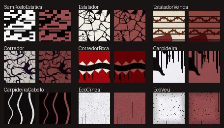

# Sprint 0014 — Contraste dos visuais

| Campo | Valor |
|-------|-------|
| Status | em teste |
| Branch | `sprint/0014-contraste-visual` |
| Plano | [plan.md](plan.md) |
| GDD | [art-direction.md](../../gdd/art-direction.md) (regra de contraste, tabela dos monstros) |
| ADR | [ADR-012](../../architecture/adr-012-visual-das-variantes.md) (consequência: visto no jogo, só textura muda) |

## Objetivo

Na névoa, de longe, cada monstro lê pelo que é: o Sem-rosto com a cabeça de TV fora do ar,
o Estalador de porcelana trincada com um X laranja nos olhos, o Corredor cinza de veias
pretas e boca vermelha rasgada, a Carpideira quase branca de cabelo preto, o Eco feito de
fumaça e cinza. Mesmos modelos, itens e GUIDs da [sprint 0012](../sprint-0012-visual-variantes/README.md).

Visto no jogo pelo Johan (05/10/2026, print): o caminho da 0012 **funciona** (a peça do
Sem-rosto renderizou no zumbi com a textura do mod), mas o chiado lia como uma balaclava de
lã cinza: ruído fino e de pouco contraste, que na câmera isométrica e sob o tom escuro da
névoa vira tricô. Decisão do Johan: opção 1, texturas bem mais agressivas nos mesmos
modelos vanilla, pra todos os visuais.

## Critérios de aceite

- [x] As nove texturas dos visuais com contraste cheio e formas grandes, medido —
      `tests/test_look_contrast.py :: test_textures_contrast` (por textura: desvio da
      luminância, fração de cinza médio 0,3–0,7 e desvio depois da média em blocos de 1/8 da
      largura; Sem-rosto: std 0,459, cinza médio 0,000, de longe 0,270, contra 0,155 / 0,739 /
      0,011 da 0012).
- [x] Textura que voltar a ser "lã" reprova — `test_contrast_catches_wool` (o ruído fino da
      0012 e o sal e pimenta por pixel, com std alto, reprovam no desvio de longe);
      `test_every_look_texture_has_limits` (textura nova sem limite reprova).
- [x] Mesmos modelos, itens, GUIDs, tamanhos e caminhos; `NOM_VariantLook` intocado —
      `git diff main -- mod/42/media` só tem os 9 PNG; `look_assets_items_resolve` (tamanho
      da vanilla), `look_assets_skins`, `look_assets_guids_unique`.
- [x] Original, procedural e determinístico — `scripts/gen_textures.py` (semente fixa),
      `look_assets_deterministic` (novo: regerar não muda um byte das 9),
      `screenfx_assets_deterministic` (os bytes da tela da 0013 não mudaram: gerador próprio);
      `credits_every_asset_listed`; descrições no `CREDITS.md`.
- [x] Prévia no tamanho do jogo — `scripts/preview_textures.py` →
      [preview.png](preview.png): cada textura a 64 px e a cópia com metade do brilho e tom
      vermelho; olhada ao fechar, nenhum desenho some na cópia escura.
- [ ] Cada monstro lê de longe, no zoom normal, debaixo da névoa comum e da vermelha —
      **falta o jogo:** roteiro, passos 1–5.
- [ ] O padrão não estica nem some nos modelos (balaclava, máscara, óculos, véu) — **falta o
      jogo:** passos 2–4.

`./run-tests.sh`: `total=503 passou=503 falhou=0` (Lua), `contraste total=3 passou=3 falhou=0`
e `build total=25 passou=25 falhou=0`.

## Roteiro in-game

Jogo em `-debug`, **save descartável**. O Johan joga de uma cópia: rodar
`scripts/dev-sync.sh`, depois **reabrir o jogo** (texturas de roupa são carregadas com o
modelo; recarregar o save pode bastar, reabrir é garantido). Console em
`~/.var/app/com.valvesoftware.Steam/Zomboid/console.txt`. Zoom normal (o padrão).

1. **Carregou.** Abrir o save. **Esperado:** nenhuma linha com `NOM_` e `ERROR` nem
   `ClothingItem not found for ItemVisual` no console.
2. **Sem-rosto.** De dia, Spawn Horde com 5 zumbis a ~6 tiles, `NOM_Debug.fog(true, true)`,
   `NOM_Debug.variant("semrosto")` no mais perto (olhar de longe, ele some quando visto).
   **Esperado:** a cabeça em blocos preto e branco com faixas, lida como "TV" a ~8 tiles,
   não como gorro de lã. **Se** a cabeça ficar cinza lisa: o mipmap da textura média os
   blocos (registrar o zoom em que some). **Se** os blocos aparecerem só na nuca: o UV da
   balaclava põe o rosto noutra região (registrar; dá pra posicionar o desenho).
3. **Estalador.** `NOM_Debug.variant("estalador")` noutro. **Esperado:** pele quase branca
   com rachaduras pretas grossas e um X laranja com contorno preto nos olhos.
4. **Corredor e Carpideira.** `NOM_Debug.variant("corredor")`: pele cinza clara com veias
   pretas, boca vermelha com uma faixa preta e dentes brancos.
   `NOM_Debug.variant("carpideira")`: corpo quase branco com escorridos pretos, manchas
   pretas debaixo dos olhos e cabelo preto com mechas brancas caindo no rosto. **Se** as
   manchas dos olhos aparecerem fora do rosto: o rosto da pele não fica onde o layout
   sugere (registrar onde aparecem).
5. **Eco e vermelha.** `NOM_Debug.night(true)`, noite, `NOM_Debug.spawnEco()`: um vulto
   quase branco com salpico escuro. Depois `NOM_Debug.redFog(true)` com zumbis à vista:
   **Esperado:** cada tipo ainda se distingue sob o vermelho. Comparar com
   `NOM_Debug.status()` (`visuais=N`).

## Checkpoints

- **04/10/2026** — Sprint aberta pelo print do Johan (05/10): pipeline da 0012 confirmado no
  jogo, chiado do Sem-rosto lido como lã. Plano.
- **04/10/2026** — Teste de contraste (vermelho nas 9 texturas da 0012), texturas novas no
  gerador, prévia em 64 px com cópia sob névoa, ajuste da venda, da boca e do cabelo pela
  prévia (padrão de período menor que 1/8 da largura vira cor lisa de longe).
- **04/10/2026** — Docs: art-direction, ADR-012, CREDITS, READMEs. Em teste.

## Aprendizados

- **Padrão repetido fino some de longe igual a ruído.** Uma grade de período ≤ 1/8 da
  textura (a primeira venda e a primeira boca) tem desvio alto e lê como cor lisa no
  tamanho do jogo; a média em blocos de 1/8 pega isso, o desvio simples não.
- **A textura vanilla da balaclava é um tricô uniforme**, sem região de rosto visível: não dá
  pra saber pelo layout onde fica a frente. O desenho tem que valer na peça inteira.
- **A pele de zumbi vanilla tem o rosto no alto e no meio** (x 44–56%, olhos em y ~12%), o
  mesmo layout no masculino e no feminino: dá pra pôr um detalhe no rosto sem copiar nada.

## Pendências que a próxima sprint herda

- Tudo do roteiro acima (nada visto no jogo ainda).
- Mipmap/filtro da textura no zoom afastado: blocos de 16 px podem virar cinza em zoom
  muito longe; se acontecer, blocos de 32 px no Sem-rosto.
- Posição da fuligem da Carpideira no rosto: lida do layout a olho; confirmar no jogo.
- Pendências da 0012 que seguem: peça por cima de peça, peça em `base:zeddmg`, engasgo no
  fim da vermelha, chiado parado.

## Sessões

- 2026-10-05 — abd764e2-7a9a-416b-b9b3-1630ab9e761f — plano, teste de contraste, texturas, prévia, docs
