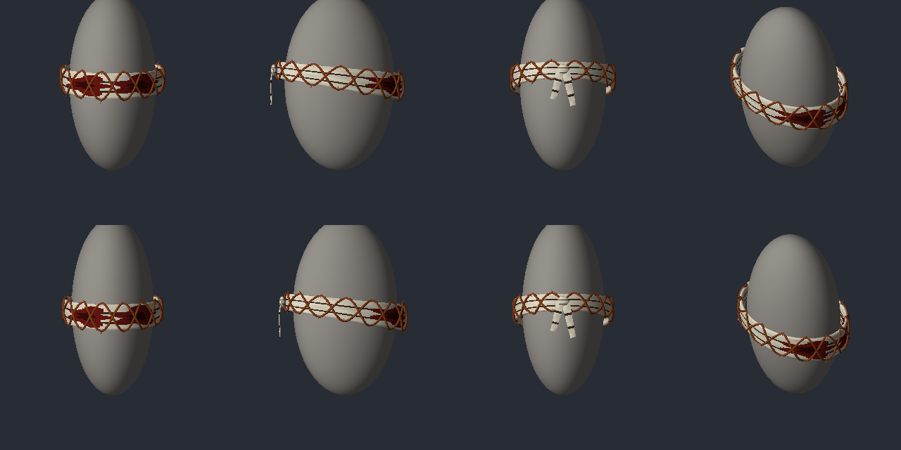

# Sprint 0041: facelift, spike (venda do Estalador em 3D)

| Campo | Valor |
|-------|-------|
| Status | `em teste` |
| Branch | `sprint/0041-facelift-spike` (saiu da `sprint/0040-vermelha-nova`, empilhada como a 0040) |
| Origem | [spec do modelo novo §9](../../superpowers/specs/2026-10-06-modelo-novo-design.md#9-facelift-dos-monstros), item 1 da ordem |
| Plano | [plan.md](plan.md) |

## O que entrou

- **A venda do Estalador virou peça 3D nossa.** Antes era textura pintada nos óculos de esqui
  vanilla. Agora tem:
  - uma faixa de atadura com volume em volta dos olhos, subindo um pouco atrás como uma faixa
    amarrada;
  - três voltas branco-sujas com frestas escuras e sangue seco em cada olho;
  - dois arames farpados ferrugem enrolados por cima, cruzando a faixa e passando pelas bordas,
    com farpas;
  - o nó atrás, com as duas pontas caindo.
- Um modelo por sexo (`NOM_M_`/`NOM_F_EstaladorVenda.x`), cada um encaixado na cabeça medida.
- **O caminho de modelo próprio ficou provado no código** e serve de base pra 0042:
  - `scripts/gen_models.py` gera o `.x` e a textura;
  - o item aponta pelo nome curto (`static\clothes\NOM_…`);
  - o jogo acha o arquivo do mod pelo mesmo mapa das texturas (bytecode,
    [pz-api-notes §32](../../architecture/pz-api-notes.md#32-modelo-3d-próprio-peça-estática-presa-à-cabeça-sprint-0041)).
- Prévia sem o jogo: `python3 scripts/preview_models.py`, que gera o [preview.png](preview.png)
  com frente, lado, trás e iso, masculino em cima e feminino embaixo. A cabeça cinza é só um
  elipsoide de referência.

## Decisões tomadas na ausência do Johan (fáceis de mudar)

- **Python puro, sem Blender.** A spec dizia Blender. Pra peça estática presa à cabeça ele não
  precisa: o `.x` é texto e a geometria sai de código. Menos dependência, mais rápido e
  testável. O Blender continua instalado: se a 0042 pedir peça com pele (que dobra com os ossos),
  ele volta pra essa peça.
- **Mesmo item, outro modelo:** `NOM_EstaladorVenda` e o gêmeo `Fx` mantêm GUID, lugar no corpo
  e Lua. Mudam só modelo e textura no XML. **Voltar pra venda antiga** é trocar, nos dois XML:
  - os modelos por `static\clothes\m_glasses_skigoggles` / `f_glasses_skigoggles`;
  - a textura por `NOM\NOM_EstaladorVenda`. O PNG antigo continua gerado.
- **Arame grosso de propósito** (3 mm de diâmetro e farpas de 5,5 mm). O arame de verdade
  sumiria: a cabeça tem uns 20 px na tela.
- **~1900 vértices por modelo.** O teto do teste é 2500, pra 0042 não inchar.
- **Textura espelhada em v**, com o arame na faixa do meio. Não sei se o jogo lê o v de cima ou
  de baixo; assim tanto faz.
- **`.x` sem templates.** O Assimp não precisa deles e o arquivo fica só com o que é nosso. Se o
  jogo recusar, o conserto é pôr os templates do formato DirectX (é spec pública, não arquivo
  do jogo).

## Testes

- `tests/test_models.py` (novo, no `run-tests.sh`), nos dois sexos:
  - formato e contagens;
  - winding igual ao vanilla;
  - malha fechada (nenhuma aresta sem par);
  - toda casca virada pra fora;
  - nada dentro da cabeça e tudo perto dos óculos, frente em +Z;
  - o UV do arame cai na ferrugem e o da atadura no pano, lendo v dos dois jeitos;
  - o gerador é determinístico.

  Cada critério tem um caso que prova que ele reprova o errado.
- `test_look_assets.lua`:
  - `own_models_resolve`: o modelo próprio existe no caminho que o jogo monta, ignorando caixa;
  - o tamanho da textura nova.
- `test_look_contrast.py`: limites da textura nova (faixas horizontais, sem cinza médio).
- `test_credits.lua`: modelos próprios citados no CREDITS (a mensagem não diz mais "vanilla").

## Code review (fim da entrega)

- Conferido que nada do jogo entrou: o gerador só usa números medidos (cinco medidas de cabeça
  por sexo e a convenção de winding), escritos à mão no `HEADS`.
- Risco aceito: o jogo pode recusar o `.x`. Nesse caso a peça some, o jogo não quebra e o
  `console.txt` mostra `Model not found`. Todo o resto do Estalador (pele, sonar) segue igual.
- Sem pendência de código.
- **Code review final da pilha (0039–0044), achado e corrigido:** as tampas das pontas abertas (o nó
  atrás) saíam viradas pra dentro. O `sweep` foi corrigido e o `test_models.py` ganhou o teste de
  aresta orientada, que pega face virada no meio da casca.

## Roteiro de teste no jogo

1. `scripts/dev-sync.sh`, reiniciar o jogo, `-debug`.
2. `NOM.fog()` (ou o botão do painel) e achar um Estalador. `NOM.panel()` tem os atalhos de
   variante.
3. Conferir:
   - a venda está nos olhos, com volume, sem atravessar a cabeça nem flutuar longe;
   - a faixa sobe um pouco atrás, e as pontas do nó caem atrás;
   - os dois arames ferrugem aparecem no zoom normal;
   - a mesma coisa num Estalador mulher.
4. Com o dissolve ligado (opção do mod), a venda se forma e se desfaz junto com a pele.
5. Se a venda sumir: procurar `Model not found` ou erro do Assimp no `console.txt` e me mandar a
   linha.
