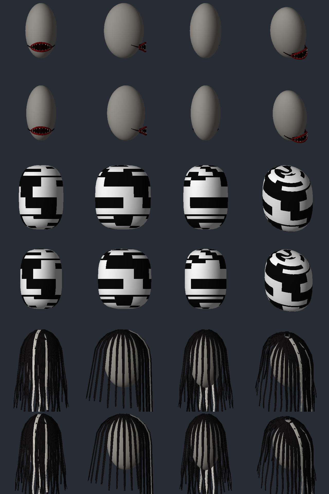

# Sprint 0042: facelift, os outros monstros em 3D

| Campo | Valor |
|-------|-------|
| Status | `em teste` |
| Branch | `sprint/0042-facelift-monstros` (saiu da `sprint/0041-facelift-spike`, empilhada) |
| Origem | [spec do modelo novo §9](../../superpowers/specs/2026-10-06-modelo-novo-design.md#9-facelift-dos-monstros), item 2 da ordem |
| Plano | [plan.md](plan.md) |

## O que entrou

O caminho da 0041 (peça estática nossa presa à cabeça, `.x` gerado por
`scripts/gen_models.py`) valeu pros outros três monstros com peça na cabeça. Um modelo por sexo,
cada um encaixado nas medidas da cabeça daquele sexo.

- **Corredor: a boca virou buraco.** Era textura na máscara cirúrgica. Agora é:
  - uma cavidade escura em lente, larga demais (≈ 7 cm por 3, quase de bochecha a bochecha), colada na frente do rosto;
  - o lábio em tubo vermelho, rasgado e irregular, afinando nos cantos;
  - oito dentes em ponta, sujos, em volta do buraco;
  - dois rasgos vermelhos subindo do canto da boca pra perto das orelhas.
- **Sem-rosto: a cabeça virou um ovo liso.** Era a balaclava inteira pintada. Agora é uma casca
  (superelipsoide) em volta da cabeça inteira, sem nariz, olho nem boca, com o mesmo chiado de
  TV (`NOM_SemRostoEstatica.png`, a textura não mudou).
- **Carpideira: o cabelo virou mechas.** Era o véu de noiva pintado. Agora são 36 mechas em fita
  saindo do alto da cabeça e caindo como cortina, mais densas e mais compridas na frente (tapam
  o rosto), três delas brancas.
- Prévia sem o jogo (`python3 scripts/preview_models.py <saída> CorredorBoca SemRostoEstatica
  CarpideiraCabelo`): frente, lado, trás e iso; masculino em cima, feminino embaixo de cada peça.

## Decisões tomadas na ausência do Johan (fáceis de mudar)

- **Mesmo item, outro modelo**, como na 0041: GUID, lugar no corpo e Lua iguais. Voltar uma peça é
  trocar modelo, estática e textura nos dois XML dela (a peça e o gêmeo `Fx`); o comentário no
  topo de cada XML da peça diz o valor antigo. As texturas antigas continuam geradas.
- **Sem-rosto mantém `nohairnobeard`** (como o capacete fechado vanilla): cabelo comprido furaria
  a casca.
- **Carpideira passa de `Group02` pra `nohair`** (como a cabeça do Spiffo): o cabelo do zumbi
  sumiria por baixo das mechas de qualquer jeito, e cabelo comprido furaria a cortina. A barba
  fica.
- **Corredor mantém `nobeard`**: a barba atravessaria a boca.
- **A casca do Sem-rosto não segue a mandíbula.** Peça estática anda com o osso da cabeça; a boca
  do zumbi abrindo pode furar embaixo. A casca tem folga de 8 mm e desce 2,2 cm além do queixo pra
  isso.
- **As mechas são rígidas.** Também andam com a cabeça: se o zumbi abaixa a cabeça, as pontas
  podem entrar no peito. Fica pro teste no jogo (pz-api-notes §32.1, item 23).
- **Texturas novas espelhadas em v** (boca e cabelo), como a da venda.

## Testes

- `tests/test_models.py`, generalizado por peça (`PIECES`), nos dois sexos:
  - os da 0041 valem pra todas: formato, winding do vanilla, malha fechada, cascas pra fora,
    até 2500 vértices, gerador determinístico;
  - **Corredor:** tudo entre o queixo e a narina, na frente do rosto; buraco ≥ 2× mais largo que
    alto;
  - **Sem-rosto:** onze pontos medidos da cabeça (alto, nuca, lados, olhos, testa, nariz, queixo,
    mandíbula) dentro da casca com folga, por paridade de raio; casca perto do capacete fechado;
  - **Carpideira:** nada no crânio; na frente do rosto, toda mecha passa na frente do nariz; pelo
    menos três mechas cruzam o rosto; três brancas; e rente à cabeça (no alto, perto do capacete;
    embaixo, abrindo no máximo uns centímetros);
  - texturas espelhadas; cada parte cai na cor certa (dente claro, boca escura, lábio vermelho,
    mecha preta, mecha branca).
- `test_look_assets.lua`: os oito modelos próprios existem no caminho que o jogo monta (16
  referências contando os gêmeos `Fx`); tamanho das texturas.
- `test_look_contrast.py`: limites das texturas novas (os mesmos das que elas substituem).
- `test_credits.lua`: modelos e texturas novos citados no CREDITS.

## Code review (fim da entrega)

- **Achado e corrigido:** o cabelo saía 22% a 56% maior que o elipsoide (uma casa decimal
  errada na folga: 2–5 cm em vez de 2–6 mm). Subia 5,5 cm acima do crânio e abria 9 cm atrás.
  Nenhum teste limitava o cabelo por fora; entrou `test_cabelo_close_to_head`, que pegou o erro
  antes do conserto.
- **Achado e corrigido:** a prévia espelhava o x da tela e cortava as faces da frente (a casca do
  Sem-rosto aparecia atrás da cabeça). Os modelos estavam certos; a prévia da 0041 foi refeita.
- Conferido que nada do jogo entrou: o gerador só usa números medidos (`HEADS`, `FACES`, `HAIR`),
  escritos à mão, com a origem na tabela do [plan.md](plan.md).
- Risco aceito, como na 0041: se o jogo recusar o `.x`, a peça some e o `console.txt` mostra
  `Model not found`; o resto do monstro segue igual.
- **Code review final da pilha (0039–0044), achado e corrigido:** as tampas das pontas abertas
  (mechas, buraco e rasgos da boca) saíam viradas pra dentro: furo na ponta e normal puxada na borda.
  Corrigido no `sweep`, com teste de aresta orientada novo. A casca do Sem-rosto não mudou.

## Roteiro de teste no jogo

1. `scripts/dev-sync.sh`, reiniciar o jogo, `-debug`.
2. `NOM.fog()` (ou o botão do painel) e achar cada monstro; `NOM.panel()` tem os atalhos de
   variante.
3. Conferir, nos dois sexos:
   - **Corredor:** a boca fica na boca (nem no nariz, nem no queixo), o buraco escuro e os dentes
     leem no zoom normal;
   - **Sem-rosto:** a cabeça é um ovo de chiado; o rosto não fura a casca quando ele ataca ou cai;
   - **Carpideira:** as mechas tapam o rosto, as três brancas aparecem, o cabelo do zumbi não
     aparece por baixo, e as pontas não entram feio no peito quando ela abaixa a cabeça.
4. Com o dissolve ligado, as três se formam e se desfazem junto com a pele.
5. Peça sumida: procurar `Model not found` ou erro do Assimp no `console.txt` e me mandar a linha.
