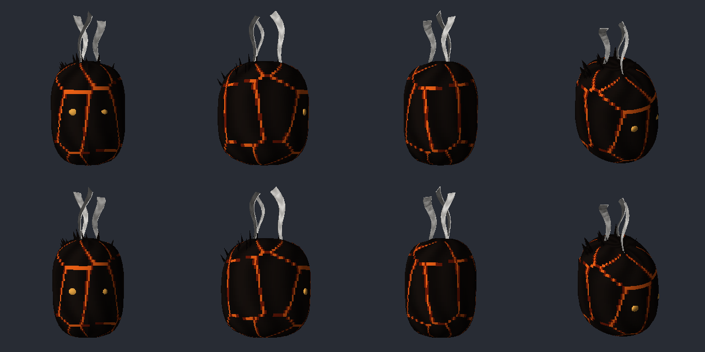

# Sprint 0043: Tição, teste de IA 3D e versão por script

| Campo | Valor |
|-------|-------|
| Status | `em teste` (versão por script); teste de IA **esperando o Johan** ([ADR-020](../../architecture/adr-020-modelos-3d-por-ia.md)) |
| Branch | `sprint/0043-ticao-ia` (saiu da `sprint/0042-facelift-monstros`, empilhada) |
| Origem | [spec do modelo novo §9](../../superpowers/specs/2026-10-06-modelo-novo-design.md#9-facelift-dos-monstros), item 3 da ordem |
| Plano | [plan.md](plan.md) |

## O que entrou

- **O Tição ganhou peça própria:** uma crosta de carvão 3D no lugar do véu de fumaça do Eco que
  usava desde a 0038. Um modelo por sexo (`NOM_M_`/`NOM_F_TicaoCrosta.x`), ~1500 vértices:
  - a cabeça inteira em placas de carvão de alturas diferentes, com rachaduras finas de brasa;
  - dois olhos de brasa acesos saindo da frente, na altura dos olhos;
  - 14 lascas de carvão espetadas no alto e atrás (nenhuma no rosto);
  - três fitas de fumaça clara subindo do alto da cabeça, torcendo.
- Itens novos `NOM_TicaoCrosta` e o gêmeo `NOM_TicaoCrostaFx` (dissolve), em `base:zeddmg` como as
  peças das variantes (o véu ficava em `base:hat` e podia tirar o chapéu do zumbi), `nohairnobeard`.
  Nome no jogo: "Crosta de carvão" / "Charcoal Crust".
- **Licenças dos modelos de IA conferidas** e a [ADR-020](../../architecture/adr-020-modelos-3d-por-ia.md)
  escrita como proposta. Resumo:
  - **Hunyuan3D-2 mini não serve pro Workshop:** a licença exclui UE, Reino Unido e Coreia do Sul, e
    proíbe distribuir ou exibir o resultado fora desse território;
  - **Stable Fast 3D serve:** licença mundial, o resultado é nosso. Mas o download é gated: precisa
    da conta do Johan aceitando os termos no Hugging Face.
- A prévia da 0041 ganhou enquadramento automático por peça (a fumaça sobe ~10 cm acima da cabeça).

## O teste de IA não rodou (decisão do Johan)

1. O Stable Fast 3D precisa que o Johan aceite os termos com a conta dele.
2. O Hunyuan baixa livre, mas o resultado não pode ir pro Workshop.
3. O review automático bloqueou instalar o pipeline (torch, pesos, dependências) com o Johan fora.

O passo a passo pra rodar, e os critérios da comparação com a versão por script, estão na ADR-020.
Até lá a versão por script é a peça do jogo, e **nada gerado por IA entrou no repositório**.

## Decisões tomadas na ausência do Johan (fáceis de mudar)

- **A crosta substitui o véu no Tição.** Voltar: em `client/NOM_VariantLook.lua`, `LOOKS.ticao` com
  `item = "Base.NOM_EcoVeu"` e `fx = "Base.NOM_EcoVeuFx"` (o XML da crosta lembra isso). O Eco
  continua com o véu dele.
- **A pele do Tição não mudou** (`Body/NOM_Ticao.png`); a crosta usa a mesma família de cores.
- **Olho em laranja claro, não vermelho:** na escuridão da preta o jogo escurece tudo; laranja claro
  é o que mais sobra. A brasa não emite luz (peça de roupa não tem emissivo).
- **Fumaça como fita fixa**, não partícula: anda com a cabeça. Partícula de fumaça de verdade fica
  pra uma sprint de efeitos, se o Johan quiser.

## Testes

- `tests/test_models.py`: a crosta cobre os onze pontos da cabeça com folga e fica perto do capacete
  fechado; dois olhos, um de cada lado, na altura dos olhos e na frente; ≥ 3 fumaças saindo do alto e
  subindo ≥ 6 cm acima do capacete; ≥ 10 lascas, nenhuma no rosto; cor por parte (lasca escura, olho
  em brasa, fumaça clara sem cor). Mais tudo da 0041–0042 (formato, winding, fechado, pra fora,
  determinístico, ≤ 2500 vértices, espelhada).
- `test_variant_look.lua`: o Tição veste a crosta e o gêmeo `Fx`.
- `test_look_assets.lua`: 15 itens, modelos próprios no caminho do jogo, gêmeo `Fx`, nomes PTBR e EN.
- `test_look_contrast.py`: limites da textura nova (os da casca de brasa).
- `test_credits.lua`: modelo e textura citados.

## Code review (fim da entrega)

- **Achado e corrigido:** duas faces de uma fita de fumaça saíam com a normal invertida onde ela
  torce (a normal suave fazia média com os lados finos). A fumaça passou a normal chapada; o teste de
  winding pegou o erro.
- **Achado e corrigido:** duas sementes do Voronoi da textura caíam quase no mesmo ponto e viravam
  uma mancha laranja grande do lado da cabeça. As sementes viraram grade com tremida (não encostam).
- A refatoração da casca (`head_shell`/`shell_grid`, reaproveitada pela crosta) deixou os `.x` do
  Sem-rosto **idênticos byte a byte**.
- Save antigo no meio de uma preta: sem risco, o visual não vai pro save (o outfit é revestido pelo
  ID no load).

## Roteiro de teste no jogo

1. `scripts/dev-sync.sh`, reiniciar o jogo, `-debug`.
2. Forçar a névoa preta (`NOM.setBlackFog()` ou o botão dele no `NOM.panel()`) e achar Tições;
   `NOM.ticao()` mostra o estado deles.
3. Conferir, nos dois sexos: a crosta cobre a cabeça; os dois olhos laranja aparecem no escuro; a
   fumaça sobe do alto; as lascas não atravessam nada feio; o chapéu do zumbi não some (agora a peça
   fica em `base:zeddmg`).
4. Com o dissolve ligado, a crosta se forma na mutação e se desfaz no fim da preta.
5. Peça sumida: procurar `Model not found` no `console.txt` e me mandar a linha.
