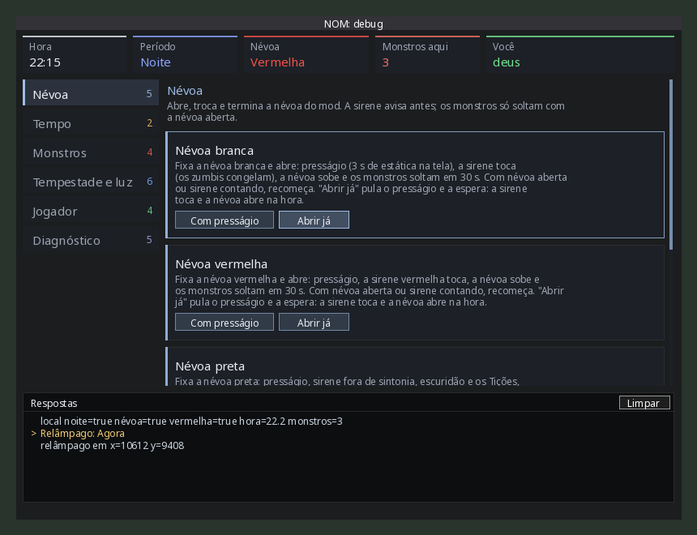
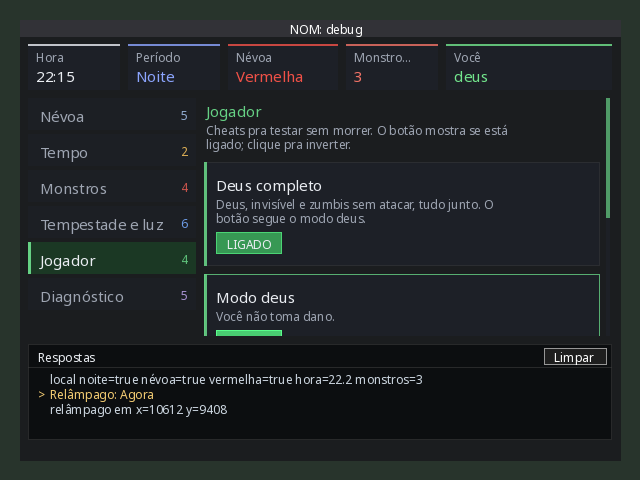

# Sprint 0046: painel de debug novo

| Campo | Valor |
|-------|-------|
| Status | `em teste` (na `staging`) |
| Branch | `sprint/0046-painel-debug` (saiu da `staging`) |
| Origem | pedido do Johan em 2026-10-07: "tem muita coisa lá, e no fim das contas eu não consigo entender o que tá acontecendo, porque o painel é muito pequeno. Queria poder dar um resize" |
| Plano | [plan.md](plan.md) |

## O que entrou

- **Janela grande e redimensionável.**
  - Abre com 820×620 e vai até o mínimo de 600×440 pelas alças do canto e da borda de baixo. Com fonte grande nas opções do jogo, o mínimo cresce até a lateral inteira caber.
  - O jogo guarda posição e tamanho com um nome novo (`NOM_DebugPanel_0046`): o leiaute do painel antigo (440 de largura) faria o novo abrir espremido.
  - Perto da borda de baixo da tela, a janela sobe em vez de encolher abaixo do mínimo.
- **Cabeçalho com o estado**, atualizado a cada segundo:
  - hora;
  - dia ou noite do mod;
  - névoa (nenhuma, branca, vermelha ou preta, na cor dela);
  - monstros na tela;
  - cheats ligados ("deus, invisível").
- **Seções na lateral**, cada uma com cor e o número de ações:
  - Névoa;
  - Tempo;
  - Monstros;
  - Tempestade e luz;
  - Jogador;
  - Diagnóstico (inclui a lista de comandos do `NOM.help()`, que agora também aparece em Respostas).
- **Cada ação é um cartão** com título, uma descrição do que faz e os botões.
  - As ações irmãs ficam juntas:
    - a hora tem 00h, 06h, 12h, 18h e 22h;
    - "Criar zumbis" tem 1, 5 e 10;
    - "Transformar o mais perto" tem os quatro monstros e Desfazer;
    - cada névoa tem "Com presságio" e "Abrir já" (que pula o presságio e a espera; a sirene toca igual).
  - Os cheats mostram LIGADO (verde) ou DESLIGADO.
  - A lista rola com a roda do mouse.
  - O botão sob o mouse acende e o clique toca o som de botão do jogo.
- **Respostas no rodapé.**
  - O que o debug responde aparece no próprio painel, do cliente e do servidor (no MP, pelo `debugReply`), com o clique ecoado em amarelo ("> Relâmpago: Agora").
  - O botão Limpar apaga a lista.
  - Tudo continua saindo no console como antes.
- **`shared/NOM_DebugLog.lua`:** as mensagens `[NOM] debug ...` do console, do `NOM_Debug` e do servidor passam por ele. Ele imprime e guarda as últimas 60 linhas.

Nenhum comando sumiu: todo `NOM.*` do `NOM.help()` tem botão, agora inclusive o próprio `NOM.help()` (só o `NOM.panel()` fica de fora). O teste clica em todos.

As prévias saem do desenho de verdade do painel (os mesmos `drawRect`/`drawText`), rodado na interface falsa do teste e pintado com outra fonte. No jogo, a fonte e a quebra de linha são as do PZ.

## Testes

- `tests/test_debug_log.lua` (novo):
  - imprime e guarda;
  - fica só com as últimas 60;
  - tira só o prefixo `[NOM] debug `;
  - o eco não vai pro console.
- `tests/test_debug.lua`: a resposta do servidor no solo, a do MP (`debugReply`) e o aviso do console caem no registro.
- `tests/test_debug_panel.lua` (reescrito, 18 testes):
  - **Abrir e fechar:** tecla, fechar, sem jogador.
  - **Tamanho:**
    - abre grande e redimensionável, com mínimo;
    - o leiaute do painel antigo não vale (o fake restaura pelo `resize` do vanilla, com mínimo e borda da tela);
    - perto da borda de baixo, a janela sobe até caber;
    - com fonte grande, a lateral inteira cabe no mínimo;
    - redimensionar refaz o leiaute;
    - no mínimo os botões não vazam.
  - **Conteúdo:**
    - toda seção e todo cartão têm descrição;
    - cada botão chama o `NOM.*` certo, com som;
    - todo comando do HELP tem botão.
  - **Navegação:**
    - a lateral troca de seção e volta pro topo;
    - a roda não passa do começo nem do fim;
    - o clique acerta o botão rolado.
  - **Estado:**
    - os toggles mostram o estado;
    - o cabeçalho atualiza a cada segundo (a preta ganha da vermelha);
    - as respostas mostram as mais novas e o Limpar apaga;
    - o hover acha o botão e todo stencil fecha.

## Review

Feito no fim da entrega, por um agente separado e lendo o diff. Nada crítico. Corrigido:

- o leiaute do painel antigo prenderia o novo no mínimo (nome novo de leiaute);
- "Abrir já" dizia que pulava a sirene: pula o presságio e a espera, a sirene toca ("Com sirene" virou "Com presságio");
- com fonte grande, a lateral não cabia no mínimo (mínimo pelas fontes);
- altura cortada pela borda da tela quebrava o leiaute (a janela sobe);
- descrições do "Vermelha (alternar)", do "Desfazer" e da noite;
- `NOM.help()` ganhou botão e sai em Respostas.

## Roteiro de teste no jogo

1. Jogo com `-debug`, mod de staging. Tecla do painel (padrão Insert) ou `NOM.panel()`.
2. A janela abre grande, com os cartões do cabeçalho em cima, as seções à esquerda e Respostas embaixo.
3. Arraste a alça do canto de baixo à direita: a janela cresce e diminui, mas não passa de 600×440. Os cartões e o texto se ajeitam na largura nova. Feche e abra de novo: volta no tamanho que ficou.
4. Clique em cada seção da lateral: a lista troca e volta pro topo. Em "Tempestade e luz" (a maior), role com a roda até o fim: o último cartão aparece inteiro, e nada vaza por cima do cabeçalho nem das Respostas.
5. Clique em "Relâmpago → Agora": em Respostas aparece "> Relâmpago: Agora" e, logo depois, "relâmpago em x=... y=...". Limpar apaga.
6. Em "Jogador", clique em "Modo deus": o botão vira LIGADO (verde) e o cartão "Você" do cabeçalho mostra "deus".
7. Abra uma névoa vermelha ("Névoa vermelha → Abrir já"): em até 1 s o cabeçalho mostra Névoa "Vermelha" em vermelho.
8. Clicar e arrastar dentro da lista não arrasta a janela; arrastar pela barra de título arrasta.

Se algo vazar do recorte ou o clique errar o botão, anote o tamanho da janela e a seção (§35, item 28 do `pz-api-notes.md`).
